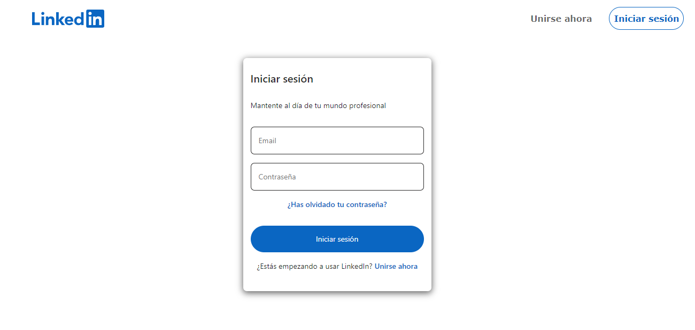
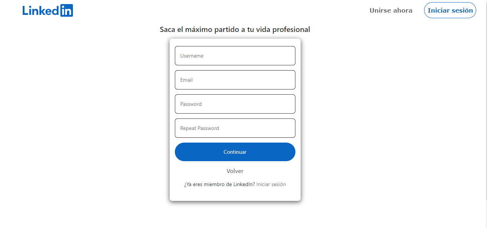
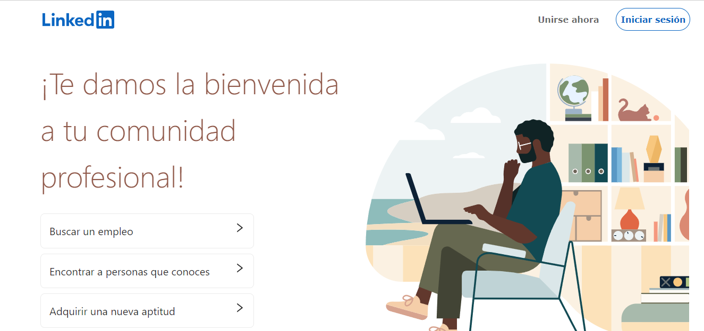

# Social Network
(Images could be broken because heroku doesn't keep them for long)
This is a MERN Stack project(MongoDB, Express, React and Node. js.) developed in The Bridge's bootcamp. I have also used Sass for the styles, based in some linkedin's styles.

## Some features
* Register(validations implemented in frontend and backend)
* Login(validations implemented in frontend and backend)
* Post
* Edit posts
* Like, unlike
* Search post by name
* Comments
* Delete posts

### Views
* Welcome view
* Profile (where you can find your personal user information and your posts).
* Post detail (if you click on the post, you will be redirected to a view where you can see only that post, and it's comments. You can also comment the post in this view).
* Home (where you can find all the posts, it's likes, comments and user's information).
* Admin (this project has roles implemented(user, author and admin), so in this view if you are the admin you can delete every post).
* 404 not found

### Endpoints
* Create user
* Log in
* Update user
* Get all users
* Log out
* Get user logged info
* Recover password
* Reset password
* Confirm email
* Follow, unfollow

* Add Post
* Edit Post
* Delete Post
* Get all posts
* Get post by ID
* Insert comment
* Update comment
* Delete comment
* Like post
* Unlike post
* Like comment
* Unlike comment
* Upload images

### Some images
Sign in:

Sign up

Welcome view

#### This App was debugged in heroku: https://sn-clase-frontend.herokuapp.com/welcome
#### Likn to the backend's repository: https://github.com/ivanpuebla10/proyectoback2

## Author ✒️
* **Ivan Puebla** - *The Bridge* - [ivanpuebla10](https://github.com/ivanpuebla10)
